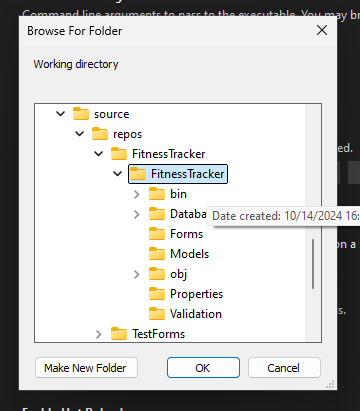

# Fitness Tracker

## Requirements

- [Visual Studio Community](https://visualstudio.microsoft.com)
- [.NET 8](https://dot.net)

> All the instructions below assume you are using `Visual Studio` (NOT VS Code).
>
> If your IDE is `VS Code` or `Rider` and you need help with the setup please create an issue on GitHub and we can figure it out together.

## Setup Launch Profile
In order to reuse the existing database, you need to point Visual Studio to the working directory.

### Steps

- Right click on the FitnessTracker project and select `Properties`
- Navigate to `Debug` section
- Under the `General` area, click on `Open debug lauch profiles UI`
- Navigate to the `Working directory` and click on `Browse`
- Browse through the directories, find and select the `FitnessTracker` project directory
  
- Select `Ok`
- Done!

## Adding Migrations

If you want to add a new database migration, open the `Package Manager Console` and follow these instructions 

### Add New Migrations

1. Open the Package Manager Console

2. Change the default project to `FitnessTracker.DataAccess`

3. Create the migrations using the following command format

```sh
Add-Migration YourMigrationTitle
```

### Update the Database

Use the following command to update the database with newly created migrations

```sh
Update-Database
```